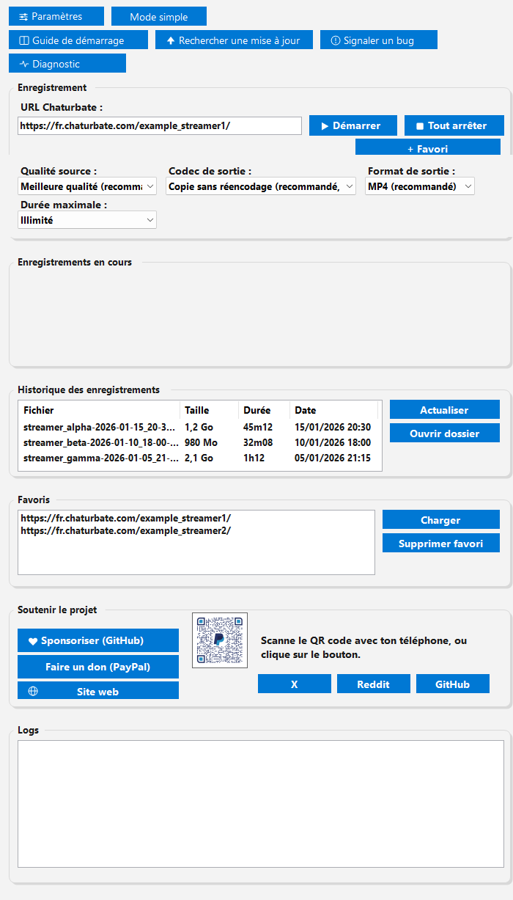

<div align="center">
  

  # Chaturbate Recorder

  Multi-stream live recorder for Windows — configurable security, quality, and privacy.

  [](https://github.com/sponsors/Tomoushie)
  [](https://github.com/Tomoushie/ChaturbateRecorder/releases/latest)
  [](https://github.com/Tomoushie/ChaturbateRecorder/releases)
  [](https://github.com/Tomoushie/ChaturbateRecorder/actions/workflows/build-test.yml)
  [](https://github.com/Tomoushie/ChaturbateRecorder/actions/workflows/security-scan.yml)
  [](https://www.nuget.org/packages/SentinelGuard)
  [](#license)
  [](https://github.com/Tomoushie/ChaturbateRecorder/stargazers)
  [](https://github.com/Tomoushie/ChaturbateRecorder/forks)
  
  
  

  🌐 [Project website](https://tomoushie.github.io/ChaturbateRecorder/) ·
  📦 [Latest release](https://github.com/Tomoushie/ChaturbateRecorder/releases/latest) ·
  📖 [Wiki](https://github.com/Tomoushie/ChaturbateRecorder/wiki) ·
  🛡️ [SentinelGuard on NuGet](https://www.nuget.org/packages/SentinelGuard) ·
  ❤️ [Sponsor the project](https://github.com/sponsors/Tomoushie) ·
  📜 [Original PowerShell version](legacy-powershell/)

  🇬🇧 **English** · 🇫🇷 [Français](README.md)
</div>

<br>



## Features

- 🎬 **Multi-stream** — records several lives in parallel without opening multiple instances of the app.
- 🎚️ **Choice of quality & codec** — best, medium, or minimum quality; optional H.264/H.265 re-encoding that never touches the original file.
- 📼 **Output format** — MP4, MKV (more resilient to an abrupt stop), or MOV.
- 🔒 **Built-in security** — hash and signature checks for yt-dlp/ffmpeg, path sandboxing, permissive-ACL detection, blocking of suspicious execution locations.
- 🕵️ **Privacy** — SOCKS5/HTTP proxy and browser cookie import for content restricted to logged-in accounts.
- 🔄 **Built-in updates** — checks GitHub releases and installs the new version automatically.
- 🌍 **Bilingual interface** — French / English, remembered between launches.
- 🗂️ **Dedicated Settings window** and minimizing to the notification area (recordings keep running in the background).
- 🐞 **Report a bug** in one click, straight to a pre-filled GitHub issue.

Full version history is in the app's "What's new" dialog, or in [`Config/Changelog.cs`](Config/Changelog.cs).

## Why this project exists

Chaturbate Recorder started as a personal [PowerShell script](legacy-powershell/),
rewritten as a WinForms .NET 10 app for better reliability,
usability, and maintainability.

**What sets it apart**: most recorders of this kind are thin wrappers
around `yt-dlp` that don't care what they run or from where. Here,
security isn't bolted on afterward — it's the starting point of the
design.

**Why it's secure**: no external binary (`yt-dlp`, `ffmpeg`) runs
without a prior SHA256 hash check and, optionally, an Authenticode
signature check. File paths and URLs go through a strict sandbox before
use. Sensitive folders' ACLs are monitored. Full detail on the
[wiki's Security page](https://github.com/Tomoushie/ChaturbateRecorder/wiki/Securite-EN)
and the [site's Features page](https://tomoushie.github.io/ChaturbateRecorder/features.html).

**Why it's reliable**: an xUnit test suite (build+tests run
automatically on every change, see the badges above), an anti-freeze
watchdog continuously monitors `yt-dlp`/`ffmpeg`, and every recording is
identified by a deterministic file name (no fragile heuristic) so
thumbnails/re-encodes always find the right file.

**What's new** compared to the original PowerShell script:
multi-stream recording, a bilingual interface, automatic updates, a
reusable NuGet package
([`SentinelGuard`](https://www.nuget.org/packages/SentinelGuard))
for anyone wanting the same validations in another .NET project, and a
full CI/CD pipeline (automated build, tests, releases, and site
deployment).

## Installation (users)

1. Download the ZIP of the [latest release](https://github.com/Tomoushie/ChaturbateRecorder/releases/latest):
   - **Standard** (~550 KB) — requires the [.NET 10 Desktop Runtime](https://dotnet.microsoft.com/download/dotnet/10.0).
   - **Portable** (~46 MB) — self-contained, no installation required.
2. Extract it wherever you like.
3. Place `yt-dlp.exe` and `ffmpeg.exe` in a `Tools\` folder next to the executable (not included, see [Prerequisites](#prerequisites-developers)).
4. Launch `ChaturbateRecorder.exe`.

Detailed guide (first-time setup, security, troubleshooting): see the **[Wiki](https://github.com/Tomoushie/ChaturbateRecorder/wiki)**.

## 🛡️ SentinelGuard — the guardrails, reusable in your own project

[](https://www.nuget.org/packages/SentinelGuard)
[](https://www.nuget.org/packages/SentinelGuard)

The security checks used by this application are published separately, for any
.NET Windows application that launches third-party binaries or handles paths
and URLs supplied by the user:

```powershell
dotnet add package SentinelGuard
```

| Class | What it guards against |
|---|---|
| `PathValidator` | UNC paths, extended paths, alternate data streams, reserved device names, symlinks |
| `UrlValidator` | Non-HTTPS schemes, domains outside your allow list, unsafe path segments and query strings |
| `BinaryVerifier` | Tampered executables: SHA-256 hash, Authenticode signature, certificate pinning |
| `AclValidator` | Folders writable by `Everyone` — where a binary you are about to run can be swapped |
| `WorkingDirectoryValidator` | Running from a network share, a temporary folder or the recycle bin |
| `CertificateValidator` | TLS interception: certificate pinning and SAN validation |

**Pure functions**: every check returns a boolean, with an optional
`out string? reason` overload giving the exact rejection cause. Nothing is
logged, nothing is thrown behind your back — you decide what to do with it.

Targets `net8.0-windows` and `net10.0-windows`, dual-licensed MIT or
Apache-2.0. Details and examples: [`SentinelGuard/README.md`](SentinelGuard/README.md).

## For developers

### Prerequisites (developers)

- [.NET 10 SDK](https://dotnet.microsoft.com/download) (Windows)
- `yt-dlp.exe` and `ffmpeg.exe` placed in `Tools\` at the project root (see
  `ChaturbateRecorderApp.csproj` — copied next to the executable on every
  build; adjust `AppConfig.YtDlpPath` / `AppConfig.FFmpegPath` if you'd
  rather use a different location)
- `donate_qr.png` in `Assets\` (already included) — copied next to the exe on build
- (optional) `ffprobe.exe` next to the executable, to show video duration
  in the recording history

### Build

```powershell
cd ChaturbateRecorderApp
dotnet build -c Release
```

The executable ends up in `bin\Release\net10.0-windows\ChaturbateRecorder.exe`.

> If `dotnet build`/`publish` fails with `NU1100` (unable to resolve a
> package), check that `NuGet.Config` at the project root is present —
> some machines' global `NuGet.Config` has no configured source, which
> blocks any external dependency.

### Tests

xUnit suite (`Tests/ChaturbateRecorderApp.Tests.csproj`) covering URL
sandboxing, path sandboxing, binary hash verification, yt-dlp progress
parsing, and TLS SAN (Subject Alternative Name) matching:

```powershell
dotnet test Tests/ChaturbateRecorderApp.Tests.csproj
```

### Publishing a self-contained .exe (single-file, no installed .NET runtime required)

```powershell
dotnet publish -c Release -r win-x64 --self-contained true -p:PublishSingleFile=true
```

Result in `bin\Release\net10.0-windows\win-x64\publish\ChaturbateRecorder.exe`
(~115 MB, .NET runtime included — needs nothing installed on the target
machine). Also copies `donate_qr.png` (and your own `yt-dlp.exe`/`ffmpeg.exe`
if you want to distribute them alongside) from that same `publish\` folder.

<details>
<summary><strong>Before the first launch (yt-dlp/ffmpeg hashes)</strong></summary>

As with the PowerShell version, `AppConfig.YtDlpExpectedSha256` and
`AppConfig.FfmpegExpectedSha256` are empty — binary integrity verification
will therefore refuse to start until they're filled in:

```powershell
Get-FileHash Tools\yt-dlp.exe -Algorithm SHA256
Get-FileHash Tools\ffmpeg.exe -Algorithm SHA256
```

Paste the resulting values into `Config/AppConfig.cs`.

</details>

<details>
<summary><strong>Signing the EXE (Authenticode)</strong></summary>

Signing an executable requires a **code-signing certificate that you
own** — I can neither provide one nor sign anything on your behalf (no
private key, no access to your machine).

#### Option 1 — commercial certificate (recommended for public distribution)

Buy a code-signing certificate from a recognized authority (DigiCert,
Sectigo, SSL.com...), then:

```powershell
signtool sign /fd SHA256 /a /f "mycert.pfx" /p "mypassword" `
    /t http://timestamp.digicert.com `
    bin\Release\net10.0-windows\ChaturbateRecorder.exe
```

`signtool.exe` is part of the Windows SDK (often already present if you
have Visual Studio installed, otherwise installable separately).

#### Option 2 — self-signed certificate (personal use only)

Only useful on **your own machine** (Windows won't trust this
certificate elsewhere, SmartScreen will keep warning on other machines):

```powershell
$cert = New-SelfSignedCertificate -Type CodeSigning -Subject "CN=YourName" `
    -CertStoreLocation Cert:\CurrentUser\My

signtool sign /fd SHA256 /sha1 $cert.Thumbprint `
    bin\Release\net10.0-windows\ChaturbateRecorder.exe
```

You can later put that same thumbprint into
`AppConfig.TrustedCaThumbprint` / `AppConfig.YtDlpExpectedSignerThumbprint`
etc. if you want to reuse this certificate to re-sign yt-dlp/ffmpeg and
enable `EnableCaPinning`.

</details>

<details>
<summary><strong>Project structure</strong></summary>

```
ChaturbateRecorderApp/
├── ChaturbateRecorderApp.csproj
├── NuGet.Config                    (explicit nuget.org source, see above)
├── Program.cs                      (entry point)
├── MainForm.cs                     (UI + event wiring)
├── Properties/
│   └── AssemblyInfo.cs             (InternalsVisibleTo for tests)
├── Config/
│   ├── AppConfig.cs                 (centralized config, equiv. of $Config in PS1)
│   └── Changelog.cs                 (version history, shown locally)
├── Security/
│   ├── BinaryVerifier.cs            (hash, Authenticode, CA pinning)
│   ├── UrlValidator.cs              (URL sandbox)
│   ├── PathValidator.cs             (folder sandbox)
│   ├── WorkingDirectoryValidator.cs (execution directory: network/temp/compressed)
│   ├── AclValidator.cs              (permissive ACL detection)
│   └── CertificateValidator.cs      (TLS + remote server SAN)
├── Services/
│   ├── Logger.cs                    (structured JSON logs)
│   ├── LogRotationManager.cs        (log purge + rotation)
│   ├── FavoritesManager.cs
│   ├── SettingsManager.cs           (persisted settings, settings.json)
│   ├── RecordingJob.cs              (recording metadata)
│   ├── DownloadEngine.cs            (yt-dlp process, anti-freeze watchdog)
│   ├── UpdateChecker.cs             (GitHub release checking)
│   └── UpdateInstaller.cs           (download + exe replacement)
├── UI/
│   ├── ThemeManager.cs               (light/dark theme, button animations)
│   ├── IconManager.cs               (vector icons, SVG->Bitmap rendering)
│   ├── Localization.cs              (FR/EN translations of the main UI)
│   ├── RoundedGroupPanel.cs          (rounded-border panels)
│   ├── SettingsForm.cs               (separate Settings window)
│   ├── ThemedProgressBar.cs          (hand-drawn progress bar)
│   └── TutorialForm.cs              (getting-started guide)
├── Assets/
│   ├── donate_qr.png
│   ├── logo.png / screenshot.png    (used by this README)
│   └── app.ico
├── Tools/                           (yt-dlp.exe / ffmpeg.exe — not versioned, see Prerequisites)
├── Tests/
│   └── ChaturbateRecorderApp.Tests.csproj  (xUnit suite, see Tests section)
├── docs/
│   └── index.html                   (project website, GitHub Pages, FR/EN)
└── legacy-powershell/                (original version before migration, see its own README)
```

</details>

## Roadmap

Detailed status (done / planned / dropped) on the
[site's Roadmap page](https://tomoushie.github.io/ChaturbateRecorder/roadmap.html),
and remaining backlog on the
[GitHub tracking board](https://github.com/users/Tomoushie/projects/2).

## Contributing

Contributions, feedback, and bug reports are welcome via the [repo's issues](https://github.com/Tomoushie/ChaturbateRecorder/issues) — or directly from the app via the **Report a bug** button. See [CONTRIBUTING.md](CONTRIBUTING.md) for details, or [Discussions](https://github.com/Tomoushie/ChaturbateRecorder/discussions) for a question/idea. Security vulnerability: see [SECURITY.md](SECURITY.md).

## Support the project

[](https://github.com/sponsors/Tomoushie)
[](https://paypal.me/tomoushie)

**[GitHub Sponsors](https://github.com/sponsors/Tomoushie)** for recurring
support, **PayPal** for a one-off donation. The application stays entirely free
and ad-free either way.

### Why sponsor?

Beyond the time spent, one specific item is currently blocked by budget rather
than by work: **Authenticode signing of the executable**. A code-signing
certificate is paid for and issued to a verified entity. Without it:

- Windows SmartScreen shows a warning on first launch, which every user has to
  dismiss manually
- the application cannot verify its own integrity at startup, and therefore
  cannot detect that it has been tampered with or cracked

It is the only roadmap item held up by money rather than effort. Everything
else moves forward regardless.

## ⚖️ Legality (Belgium)

Chaturbate Recorder only records publicly accessible streams, the ones the user can already watch in their browser. The software circumvents no technical protection measure, accesses no private system or content, and exploits no vulnerability: the offences of unauthorised access to a computer system (art. 550bis of the Belgian Criminal Code) and of computer sabotage (art. 550ter) are therefore not engaged.

Recording a public stream may fall under the private-copy exception of Belgian copyright law (art. XI.190 of the Code of Economic Law, formerly art. 22, §1, 5° of the Act of 30 June 1994), as long as the use remains strictly personal and non-commercial. Conversely, distributing, sharing, transmitting or making available a sexual recording of a person without their consent is a criminal offence in Belgium (art. 417/5 of the Criminal Code), regardless of how the recording was obtained.

The user alone is responsible for what they do with the recordings. It is up to them to check the platform's terms of service — which may prohibit recording **independently of the law**, a breach of contract exposing them to account termination rather than criminal prosecution —, the image rights and data protection of the people filmed, as well as the applicable copyright and the legislation of their country of residence.

*This text is informative and does not constitute legal advice.*

## License

Dual-licensed, your choice: [MIT](LICENSE-MIT) or [Apache License 2.0](LICENSE-APACHE).

Unless you explicitly state otherwise, any contribution intentionally
submitted for inclusion in this project shall be dual-licensed as above,
without any additional terms or conditions.
