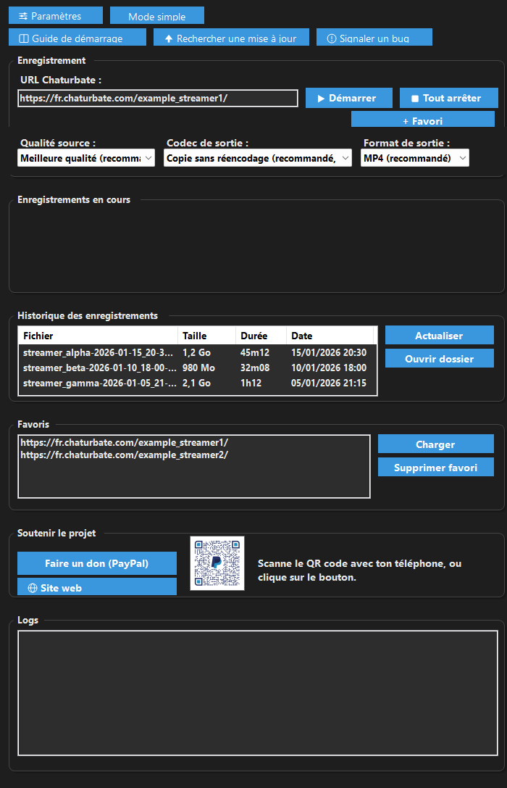
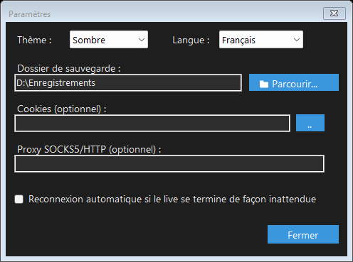

<link rel="stylesheet" href="assets/lang-toggle.css">
<button id="langToggle" class="lang-toggle-btn" type="button"></button>

# Captures d'écran

*Les URLs, noms de fichiers et chemins ci-dessous sont des exemples
fictifs — aucune donnée réelle d'utilisateur.*

## Fenêtre principale — thème clair

## Fenêtre principale — thème sombre

## Fenêtre Paramètres

---

[← Retour à l'accueil](index.html) · [Fonctionnalités](features.html) · [Roadmap](roadmap.html) · [SentinelGuard](sentinelguard.html)

# Screenshots

*The URLs, file names, and paths below are fictional examples — no real
user data.*

## Main window — light theme

## Main window — dark theme

## Settings window

---

[← Home](index.html) · [Features](features.html) · [Roadmap](roadmap.html) · [SentinelGuard](sentinelguard.html)

